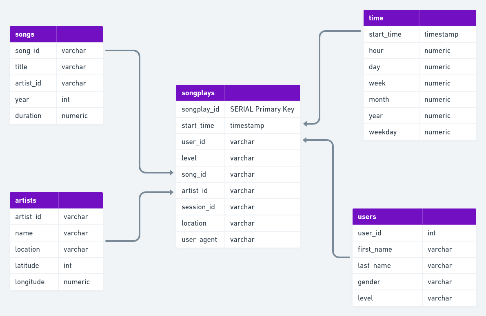

# Data Modeling with Postgres

## **Introduction**

This project is part of the Data Engineering Nanodegree Program.

A startup called Sparkify wants to analyze the data they've been collecting on songs and user activity on their new music streaming app. The analytics team is particularly interested in understanding what songs users are listening to. Currently, they don't have an easy way to query their data, which resides in a directory of JSON logs on user activity on the app, as well as a directory with JSON metadata on the songs in their app.

They'd like a data engineer to create a Postgres database with tables designed to optimize queries on song play analysis, and bring you on the project. Your role is to create a database schema and ETL pipeline for this analysis. You'll be able to test your database and ETL pipeline by running queries given to you by the analytics team from Sparkify and compare your results with their expected results.

## **Project Description**

### **Song Dataset**

The first dataset is a subset of real data from the **[Million Song Dataset](https://labrosa.ee.columbia.edu/millionsong/)**. Each file is in JSON format and contains metadata about a song and the artist of that song. The files are partitioned by the first three letters of each song's track ID. For example, here are filepaths to two files in this dataset.

```
song_data/A/B/C/TRABCEI128F424C983.json
song_data/A/A/B/TRAABJL12903CDCF1A.json

```

And below is an example of what a single song file, TRAABJL12903CDCF1A.json, looks like.

```
{
    "num_songs": 1,
    "artist_id": "ARC43071187B990240",
    "artist_latitude": null,
    "artist_longitude": null,
    "artist_location": "Wisner, LA",
    "artist_name": "Wayne Watson",
    "song_id": "SOKEJEJ12A8C13E0D0",
    "title": "The Urgency (LP Version)",
    "duration": 245.21098,
    "year": 0
}
```

### **Log Dataset**

The second dataset consists of log files in JSON format generated by this based on the songs in the dataset above. These simulate activity logs from a music streaming app based on specified configurations.

```{
    "artist": "A Fine Frenzy",
    "auth": "Logged In",
    "firstName": "Anabelle",
    "gender": "F",
    "itemInSession": 0,
    "lastName": "Simpson",
    "length": 267.91138,
    "level": "free",
    "location": "Philadelphia-Camden-Wilmington, PA-NJ-DE-MD",
    "method": "PUT",
    "page": "NextSong",
    "registration": 1541044398796.0,
    "sessionId": 256,
    "song": "Almost Lover (Album Version)",
    "status": 200,
    "ts": 1541377992796,
    "userAgent": "\"Mozilla\/5.0 (Macintosh; Intel Mac OS X 10_9_4) AppleWebKit\/537.36 (KHTML, like Gecko) Chrome\/36.0.1985.125 Safari\/537.36\"",
    "userId": "69"
    }
```

### **Prerequisites**
This project makes the folowing assumptions:

- Python 3 is available
- pandas and psycopg2 are available
- A PosgreSQL database is available on localhost

## **Running Script**

At the terminal:

- python create_tables.py
- python etl.py

## **Database Schema** ##


